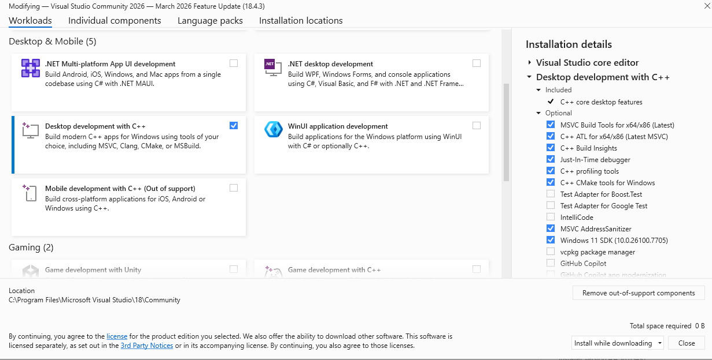

Compiling and Installing HORAYZON Native on Windows
===================================================

HORAYZON relies heavily on Intel Embree, Threading Building Blocks (TBB), and Cython. While it compiles easily on Linux/macOS, the Microsoft Visual C++ (MSVC) compiler on Windows is much stricter regarding C++ standards and type matching.

Follow this step-by-step guide to patch the source code, compile the C++ extensions, and generate a pre-compiled `.whl` (Wheel) file for easy installation across Windows environments.

Prerequisites
-------------

1.  **Python 3.11+** (We recommend creating a virtual environment: `python -m venv .venv`).

2.  **Microsoft C++ Build Tools:** Download and install the [Visual Studio Build Tools](https://www.google.com/search?q=https://visualstudio.microsoft.com/visual-cpp-build-tools/). Ensure "Desktop development with C++" is checked.


3.  **Intel Embree:** Download the Windows binary release (e.g., v4.4.1) and extract it to eg `C:\Program Files (x86)\embree\embree-4.4.1.x64.windows`.

4.  **Intel Threading Building Blocks (TBB):** Download the Windows binary release (e.g., oneAPI TBB 2022.3.0) and extract it to eg `C:\Program Files (x86)\tbb\oneapi-tbb-2022.3.0`.

5.  **Update `setup.py`:** Ensure the `path_include` and `path_lib` variables in `setup.py` point to the exact paths where you extracted Embree and TBB.

 ```bash
# Paths for Intel Embree and Threading Building Blocks (TBB) see sintructions https://gemini.google.com/app/97da47df0584dd11?
path_include = [
    r"C:\Program Files (x86)\embree\embree-4.4.1.x64.windows\include",
    r"C:\Program Files (x86)\tbb\oneapi-tbb-2022.3.0\include"
]

path_lib = [
    r"C:\Program Files (x86)\embree\embree-4.4.1.x64.windows\lib\embree4",
    r"C:\Program Files (x86)\tbb\oneapi-tbb-2022.3.0\lib\intel64\vc14\tbb12"
]
# Add this lines to force the Windows library extension:
# Windows specific variables
lib_end = ".lib"
extra_compile_args_cpp = ['/O2', '/EHsc']
extra_link_args_cpp = []

# - depending on defined library paths and loaded modules, it might be
#   necessary to add paths to further libraries like 'libimf' and 'libtbb'
# - in case a library is not found during execution of HORAYZON, it has to be
#   defined before running Python/HORAYZON via 'LD_LIBRARY_PATH'.

 ```
* * * * *

Step 1: Patching the Source Code for MSVC Compatibility
-------------------------------------------------------

Before compiling, we must make a few adjustments to the C++ code to satisfy the MSVC compiler.

### 1.1 Fix Cython / C++ Integer Type Mismatch

On Windows, Cython maps NumPy's 32-bit integers (`np.npy_int32`) to a C `long`. However, the C++ header expects a standard `int`. MSVC will refuse to compile this mismatch.

**In `horayzon/horizon_comp.h`:** Change the `int* tri_ind_simp` argument to `long* tri_ind_simp` in the declarations for both `horizon_gridded_comp` and `horizon_locations_comp`.

**In `horayzon/horizon_comp.cpp`:** Change the signatures to match the header (`long* tri_ind_simp`). Because the internal Embree helper function still expects an `int*`, find the `initializeScene` call inside `horizon_gridded_comp` (around line 554) and cast it explicitly:

C++

```
// Change this:
RTCScene scene = initializeScene(device, vert_grid, dem_dim_0, dem_dim_1,
    geom_type, vert_simp, num_vert_simp, tri_ind_simp, num_tri_simp);

// To this:
RTCScene scene = initializeScene(device, vert_grid, dem_dim_0, dem_dim_1,
    geom_type, vert_simp, num_vert_simp, (int*)tri_ind_simp, num_tri_simp);

```

### 1.2 Enable Math Constants (`M_PI`)

MSVC does not define math constants like `M_PI` by default.

**In both `horayzon/horizon_comp.cpp` and `horayzon/shadow_comp.cpp`:** Add `#define _USE_MATH_DEFINES` at the very top of the files, strictly *before* including `<math.h>`:

C++

```
#include <cstdio>
#include <embree4/rtcore.h>
#include <stdio.h>
#define _USE_MATH_DEFINES // <-- ADD THIS
#include <math.h>

```

### 1.3 Remove Variable-Length Arrays (VLAs)

Standard C++ does not allow array sizes to be defined by runtime variables (e.g., `float azim_sin[azim_num];`). While GCC (Linux) allows this, MSVC strictly forbids it (`error C2131`). We must switch to heap allocation using `new`.

**In `horayzon/horizon_comp.cpp` and `shadow_comp.cpp` if applicable:**
 Locate the array initializations inside the main computation functions and change them from stack arrays to pointer arrays:

C++

```
// Change this:
float azim_sin[azim_num];
float azim_cos[azim_num];
int elev_num = ...;
float elev_ang[elev_num];
float elev_sin[elev_num];
float elev_cos[elev_num];

// To this:
float* azim_sin = new float[azim_num];
float* azim_cos = new float[azim_num];
int elev_num = ...;
float* elev_ang = new float[elev_num];
float* elev_sin = new float[elev_num];
float* elev_cos = new float[elev_num];

```

*CRITICAL:* Because you used `new`, you must prevent memory leaks. Add the following at the very end of those same functions, right before the closing `}`:

C++

```
delete[] azim_sin;
delete[] azim_cos;
delete[] elev_ang;
delete[] elev_sin;
delete[] elev_cos;

```

* * * * *

Step 2: Generating the Pre-Compiled Wheel (.whl)
------------------------------------------------

With the code patched, you can compile the C++ extensions and bundle them into a reusable Wheel file. This saves you from ever having to compile the code again on this machine.

Open your command prompt, activate your virtual environment, navigate to the `HORAYZON` root folder, and run:

DOS

```
python -m pip wheel . -w dist

```

If successful, `pip` will compile the code and generate a `.whl` file inside a newly created `dist/` directory (e.g., `dist/horayzon-1.0.0-cp311-cp311-win_amd64.whl`).

* * * * *

Step 3: Installation
--------------------

To install HORAYZON in any Python environment on your Windows machine, simply point `pip` to the wheel you just built:

DOS

```
python -m pip install path\to\dist\horayzon-1.0.0-cp311-cp311-win_amd64.whl

```

*(Note: Never run the Python interpreter from the root of the source code folder, or Python will try to load the uncompiled folder instead of the installed package, causing a `circular import` error!)*

* * * * *

Step 4: The Windows DLL Fix (Crucial!)
--------------------------------------

Even after a successful installation, running `import horayzon` will likely result in an `ImportError: DLL load failed`. This is because Windows cannot find the Intel Embree and TBB runtime binaries.

Starting in Python 3.8, Python ignores the Windows System PATH for security reasons. You have two options to fix this:

### Option A: Copy the DLLs (Recommended)

Navigate to your active Python environment's `site-packages\horayzon` folder: `...\.venv\Lib\site-packages\horayzon`

Copy the following two files into that directory:

1.  `embree4.dll` (Found in `C:\Program Files (x86)\embree\...\bin`)

2.  `tbb12.dll` (Found in `C:\Program Files (x86)\tbb\...\bin` or `redist\intel64\vc14`)

### Option B: Declare DLLs in Python

Add the explicit paths to your Python script *before* importing the module:

Python

```
import os
os.add_dll_directory(r"C:\Program Files (x86)\embree\embree-4.4.1.x64.windows\bin")
os.add_dll_directory(r"C:\Program Files (x86)\tbb\oneapi-tbb-2022.3.0\redist\intel64\vc14")

import horayzon

```

* * * * *

You are now ready to use HORAYZON's high-performance ray tracing on Windows!